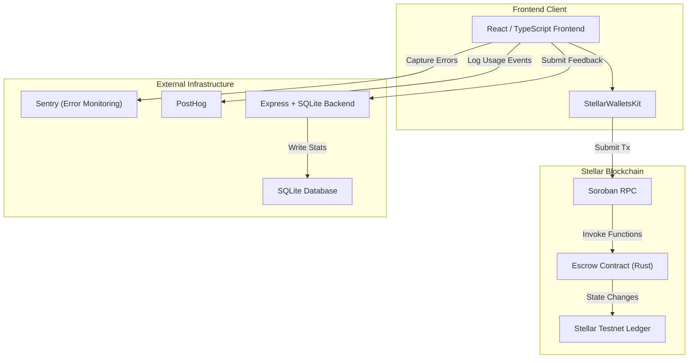
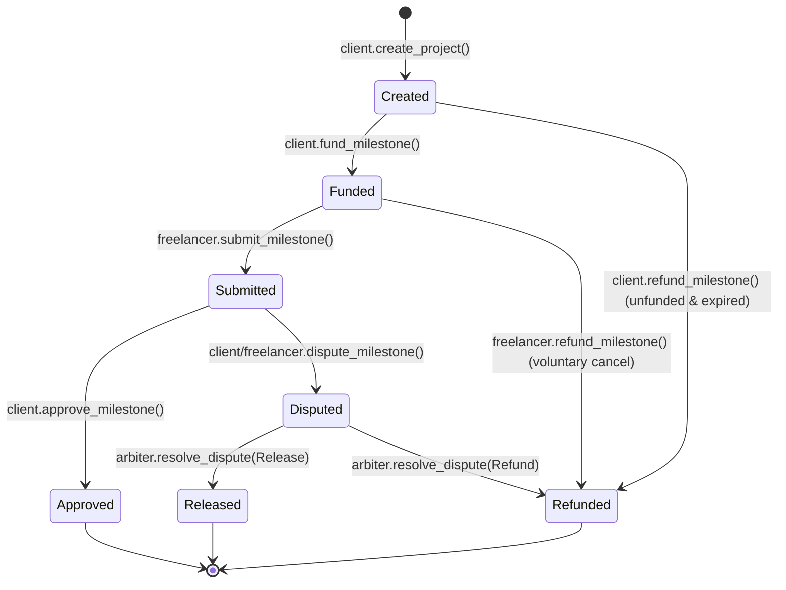
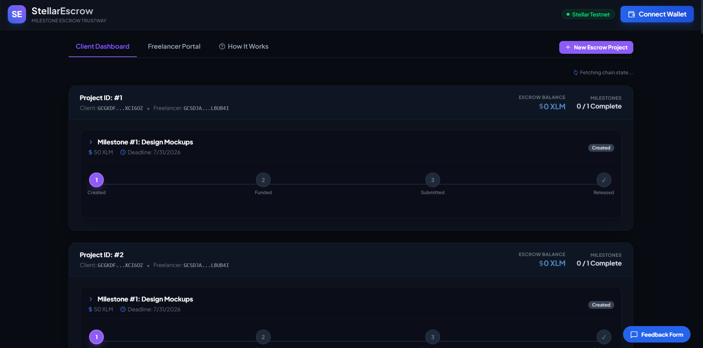
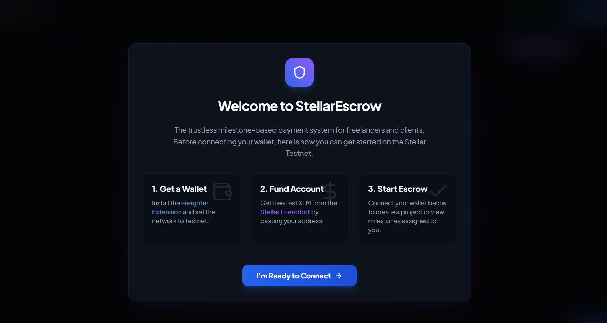
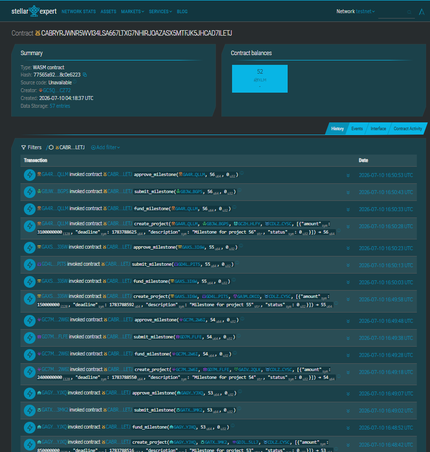

# StellarEscrow
### Trustless Milestone-Based Freelance Payment Escrow on Stellar

---

## 📖 Overview

StellarEscrow addresses the critical challenge of trust in the digital freelance economy. In traditional freelance arrangements, clients risk paying for incomplete or low-quality work, while freelancers risk non-payment after dedicating time and resources to a project. StellarEscrow solves this friction by utilizing decentralized, milestone-based smart contracts built on Stellar's Soroban platform. 

By locking project funds in a secure, decentralized escrow contract, clients demonstrate financial commitment upfront. Freelancers can verify that the funds are secured on-chain before commencing work. The locked capital is released progressively as milestones are completed, reviewed, and approved. A dedicated arbiter role ensures fair dispute resolution, protecting both parties.

Designed for freelancers, independent contractors, small agencies, and clients, StellarEscrow combines the security and transparency of decentralized finance with a user-friendly, responsive interface. It offers a smooth onboarding experience that hides the complexities of Web3 transactions behind standard user flows, ensuring accessibility for non-technical users.

---

## 🌐 Live Demo

*   **Live Web Application**: [s-stellar-escrow.vercel.app](https://s-stellar-escrow.vercel.app/)
*   **Video Demonstration**: [Watch Live Demo](https://youtu.be/viEaqNnIvz0) *(1-2 minute walkthrough of key user flows)*

---

## ✨ Key Features

*   **Multi-Wallet Connection**: Seamless connection to the Stellar network using Freighter, Rabe, or other supported wallets via `StellarWalletsKit`.
*   **Decentralized Project Creation**: Clients can initialize a project with multiple, distinct milestones (specifying amount, description, and deadline) directly on-chain.
*   **On-Chain Escrow Funding**: Security of funds achieved by locking the required XLM into the escrow contract per milestone.
*   **State-Driven Milestone Flow**: Comprehensive step-by-step workflow covering milestone creation, funding, submission, approval, and dispute resolution.
*   **Arbiter Dispute Flagging**: Ability to flag milestones in dispute, locking funds until resolved by a designated arbiter address.
*   **Real-Time Status Dashboard**: Status updates showing current milestone progress, balances, and next actions.
*   **Mobile-Responsive Design**: Clean and responsive UI layout designed for a great user experience on both mobile and desktop screens.
*   **Error Monitoring & Analytics**: Integration of Sentry for tracking runtime errors and custom event tracking to measure engagement and success rates.
*   **Integrated Feedback System**: Built-in feedback form capturing ratings and reviews to assess user satisfaction.

---

## 🏗️ Architecture

The system comprises a frontend React client, a rust-based Soroban contract, a backend telemetry and feedback server, and integration with third-party monitoring/analytics platforms.

### System Diagram



### Milestone State Machine

Milestone progress is governed by a finite state machine enforced by the smart contract:



*   **Created**: Milestone metadata is saved on-chain but no funds are committed.
*   **Funded**: The client deposits and locks XLM into the contract. It is now safe for the freelancer to work.
*   **Submitted**: Freelancer uploads deliverables and marks the milestone as complete.
*   **Approved**: Client accepts deliverables and releases funds to the freelancer's wallet address.
*   **Disputed**: Funds are locked because of a performance conflict, awaiting arbitration.
*   **Refunded**: Funds are returned to the client (due to voluntary cancellation by the freelancer, expiry of an unfunded milestone, or arbiter resolution).

---

## 🛠️ Tech Stack

| Layer | Technology / Tool Used | Purpose |
|---|---|---|
| **Frontend** | React, Vite, TypeScript, Tailwind CSS | UI Structure, Styling, and State Logic |
| **Smart Contract** | Soroban SDK, Rust | Trustless Escrow and State Management |
| **Wallet Integration** | `@creit.tech/stellar-wallets-kit`, `@stellar/stellar-sdk` | Wallet Connectivity & Transaction Construction |
| **Analytics** | PostHog | Tracking User Engagement Events |
| **Monitoring** | Sentry | Real-time Error Detection & Performance Tracking |
| **Backend (Feedback)** | Express.js, Node.js | Aggregating Feedback Telemetry & Sentiment Reviews |
| **Database** | SQLite | Storage of User Ratings & Comments |
| **Deployment** | Vercel / Netlify | Hosting the Frontend Web Client |

---

## 📜 Smart Contract Details

*   **Network**: Stellar Testnet
*   **Deployed Contract Address**: `CABRYRJWNR5WVI34LSA667LTXG7NHIRJOAZASX5MTFJK5JHCAD7ILETJ`
*   **Stellar Expert Link**: [View Contract on Stellar Expert](https://stellar.expert/explorer/testnet/contract/CABRYRJWNR5WVI34LSA667LTXG7NHIRJOAZASX5MTFJK5JHCAD7ILETJ)

### Contract Interface Functions

*   `create_project(client: Address, freelancer: Address, arbiter: Address, milestones: Vec<MilestoneInput>) -> u64`
    *   Initializes a project with a list of milestone inputs and returns a unique Project ID.
*   `fund_milestone(project_id: u64, milestone_idx: u32, client: Address)`
    *   Locks the milestone amount in XLM from the client's wallet into the escrow contract.
*   `submit_milestone(project_id: u64, milestone_idx: u32, freelancer: Address)`
    *   Updates the milestone status to `Submitted`, indicating the work is ready for client approval.
*   `approve_milestone(project_id: u64, milestone_idx: u32, client: Address)`
    *   Releases the locked XLM for the milestone, transferring it directly to the freelancer's address.
*   `dispute_milestone(project_id: u64, milestone_idx: u32, caller: Address)`
    *   Flags the milestone as disputed, locking the funds until resolved.
*   `resolve_dispute(project_id: u64, milestone_idx: u32, arbiter: Address, resolve_to_client: bool)`
    *   Called by the arbiter to release locked funds to either the client (refund) or freelancer (release).
*   `refund_milestone(project_id: u64, milestone_idx: u32, caller: Address)`
    *   Performs refunds for expired unfunded milestones or voluntary freelancer cancellations.
*   `get_project(project_id: u64) -> Project`
    *   Retrieves project details, addresses, and overall configuration.
*   `get_milestones(project_id: u64) -> Vec<Milestone>`
    *   Returns the list of all milestones and their current states for a given project.

### Storage Optimization Choices
StellarEscrow utilizes a hybrid storage architecture in Soroban to optimize storage fees and prevent state expiration:
* **Instance Storage** is used to store core configuration metadata (such as the native asset contract ID) that is queried frequently by the contract and occupies minimal state space.
* **Persistent Storage** is used for project details and milestone states (`Project`, `Milestone`), ensuring that this long-term state remains permanently on the ledger and does not expire while funds are locked in active escrows.

---

## 🏃 Getting Started & Local Setup

### Prerequisites

*   **Node.js**: v18.0.0 or higher
*   **Rust Toolchain**: `cargo` with `wasm32-unknown-unknown` target configured
*   **Stellar CLI**: Installed and accessible in your shell environment path
*   **Browser Wallet**: Freighter Browser Extension (configured for Stellar Testnet)
*   **Test Account**: A funded Stellar Testnet wallet account (can be funded via Friendbot)

### Local Setup Instructions

1.  **Clone the Repository**:
    ```bash
    git clone https://github.com/shwetasharma44044-eng/SStellarEscrow.git
    cd SStellarEscrow
    ```

2.  **Configure Environment Variables**:
    Create a `.env` file in the `frontend` folder:
    ```env
    VITE_CONTRACT_ID=CABRYRJWNR5WVI34LSA667LTXG7NHIRJOAZASX5MTFJK5JHCAD7ILETJ
    VITE_SOROBAN_RPC_URL=https://soroban-testnet.stellar.org
    VITE_NETWORK_PASSPHRASE="Test SDF Network ; September 2015"
    VITE_POSTHOG_TOKEN=[YOUR_POSTHOG_TOKEN]
    VITE_SENTRY_DSN=[YOUR_SENTRY_DSN]
    VITE_FEEDBACK_BACKEND_URL=http://localhost:5000/api
    ```

3.  **Install & Start Backend Server**:
    ```bash
    cd backend
    npm install
    npm start
    ```
    *The feedback backend service runs on `http://localhost:5000`.*

4.  **Install & Run Frontend Client**:
    ```bash
    cd ../frontend
    npm install
    npm run dev
    ```
    *Open `http://localhost:5173` in your browser.*

### Build & Deploy Smart Contract (Optional)

If you want to build and deploy the contract yourself:

1.  **Build the Contract WASM**:
    ```bash
    cd contracts/escrow_contract
    stellar contract build
    ```
2.  **Deploy to Stellar Testnet**:
    ```bash
    stellar contract deploy \
      --wasm target/wasm32-unknown-unknown/release/escrow_contract.wasm \
      --source-account my-stellar-identity \
      --network testnet
    ```
3.  **Initialize the Contract**:
    ```bash
    stellar contract invoke \
      --id CABRYRJWNR5WVI34LSA667LTXG7NHIRJOAZASX5MTFJK5JHCAD7ILETJ \
      --source-account my-stellar-identity \
      --network testnet \
      -- \
      initialize \
      --native_sac CDLZFC3SYJYDZT7K67VZ75HPJVIEUVNIXF47ZG2FB2RMQQVU2HHGCYSC
    ```

---

## 💡 How to Use

### Client Workflow
1.  **Connect Wallet**: Click "Connect Wallet" on the top right and approve connection in Freighter.
2.  **Create Project**: Click "Create Project". Enter the Freelancer's address, the Arbiter's address, and define the milestones. Submit the transaction and sign with Freighter.
3.  **Fund Milestone**: Locate the newly created project. Under the milestone list, click **"Fund Milestone"** and sign the deposit transaction.
4.  **Review & Approve**: Once the freelancer submits their work, click **"Approve & Release"** to dispatch the escrowed funds to the freelancer's wallet.
5.  **Initiate Dispute**: If the work is incomplete or incorrect, click **"Dispute Milestone"** to lock the funds and escalate to the Arbiter.

### Freelancer Workflow
1.  **Connect Wallet**: Log in using your Stellar public key.
2.  **View Assignments**: Check the Freelancer tab to view all projects assigned to your wallet address.
3.  **Track Funding**: Ensure the milestone status displays **"Funded"** before starting tasks.
4.  **Submit Milestone**: Once completed, click **"Submit Work"** and sign the signature payload. Your client will be notified to review.

---


## 📊 Monitoring & Analytics

### Event Telemetry
We use **PostHog** to monitor operations, track metrics, and evaluate DApp usability. The following custom actions are tracked:
*   `wallet_connected`: Triggered when users connect Freighter.
*   `project_created`: Logs successful on-chain project creation.
*   `milestone_funded`: Emitted when clients lock funds.
*   `milestone_submitted`: Captured when freelancers present deliverables.
*   `milestone_approved`: Dispatched when funds are released.
*   `milestone_disputed`: Sent when a dispute is opened.

These statistics can be analyzed in real-time in the **PostHog** dashboard to understand contract execution rates, user demographics, and dashboard load times.

### Error Tracking & Stability
We have integrated **Sentry** to capture client-side runtime errors. Sentry logs:
*   Rejected browser signature requests.
*   Network disconnection warnings or RPC failure timeouts.
*   Validation errors in project configurations.

This logging allows us to maintain a highly stable client interface and resolve client-side exceptions proactively.

---

## 🧪 Testing

### Smart Contract Tests
Smart contract logic is tested using Rust's built-in cargo testing framework.
To run tests:
```bash
cargo test --manifest-path contracts/escrow_contract/Cargo.toml --target-dir target_test -j 1
```
These tests cover:
*   Milestone state transitions (Created $\rightarrow$ Funded $\rightarrow$ Submitted $\rightarrow$ Approved).
*   Enforcement of client-only permissions for funding and approvals.
*   Dispute arbitration flows and correct token disbursement.
*   Prevention of double-funding or double-release.

### Frontend Application Tests
Unit and integration tests for frontend React utilities and services are configured.
To run frontend tests:
```bash
cd frontend
npm test
```
These tests verify:
*   Correct formatting of XLM amounts to Stroops.
*   Validation check logic for milestones (deadlines in the future, positive amounts).
*   Proper rendering of the dashboard lists based on mock state variables.

---

## 📂 Project Structure

```text
SStellarEscrow/
├── .github/
│   └── workflows/              # GitHub Actions CI/CD workflows
├── backend/
│   ├── db/                     # SQLite database schema and instance
│   ├── server.js               # Express API backend for feedback
│   └── package.json
├── contracts/
│   └── escrow_contract/
│       ├── Cargo.toml          # Smart contract dependencies configuration
│       └── src/
│           ├── lib.rs          # Main contract entrypoint
│           └── test.rs         # Soroban contract testing suite
├── docs/                       # Technical documentations and spec sheets
├── frontend/
│   ├── public/                 # Static assets
│   ├── src/
│   │   ├── assets/             # Images, icons, and branding
│   │   ├── components/         # Reusable UI component blocks (optional/placeholders)
│   │   ├── hooks/              # Custom React hooks (optional/placeholders)
│   │   ├── services/
│   │   │   ├── analyticsService.ts # Event logging implementation
│   │   │   ├── contractService.ts  # SDK contract interaction wrappers
│   │   │   └── feedbackService.ts  # Feedback submission interface
│   │   ├── types/              # TypeScript types and definitions
│   │   ├── App.css             # Main styling
│   │   ├── App.tsx             # Primary dashboard application
│   │   ├── index.css           # Global layout & utility styling
│   │   └── main.tsx            # React entrypoint
│   ├── package.json
│   ├── tsconfig.json
│   └── vite.config.ts
├── README.md                   # Project overview and setup guides
└── TRANSACTIONS_PROOF.md       # On-chain testnet simulation documentation
```

---

## 🗺️ Roadmap

*   **Phase 1 (MVP - Level 4 Green Belt)**: Soroban core contract deployment, React client dashboard integration, telemetry logging, and local feedback loop.
*   **Phase 2 (Anchor Integration)**: Integration of Stellar Anchors (SEP-24) to support credit card and fiat currency deposits and withdrawals, converting directly to XLM or stablecoins inside the escrow contract.
*   **Phase 3 (Decentralized Disputes)**: Multi-signature and multi-arbitrator consensus engine to resolve disputes without a single point of failure.
*   **Phase 4 (Mainnet Launch)**: Security audits, optimization of gas/fees, and deployment of StellarEscrow on the Stellar Mainnet.

---

## 📄 License

Distributed under the MIT License. See `LICENSE` for details.

---

## 🧪 AB Testing Note
This is a small update added for AB testing purposes to verify pipeline triggers, commit signatures, and automated deployment integrations.

---

## 🚀 Level 5 Update — Growth & Iteration

### User Growth & Activity
- Total real testnet users onboarded: 55 (50+ required)
- Total real on-chain transactions: 72
- Telemetry screenshot: See [Screenshots Section](#screenshots-level-5) below.
- Unique wallets interacted (sample or full list): [Excel Sheet Link](https://docs.google.com/spreadsheets/d/1oi91tFBPbNROr84q7bpsj2293100Dg0jBBx0nwfBTdY/edit?usp=sharing)

### Feedback Collection
- Feedback collected via Google Form: [StellarEscrow — User Feedback Form](https://docs.google.com/forms/d/14RBShBmGJ2oQth-NCmtNgBy0wzRQmB-sBPPNKH6HFiM/edit)
- Form fields: Name, Email, Wallet Address, Product Rating, Comments
- All responses exported to Excel for record-keeping: [Excel Sheet Link](https://docs.google.com/spreadsheets/d/1oi91tFBPbNROr84q7bpsj2293100Dg0jBBx0nwfBTdY/edit?usp=sharing)
- Total responses: 55, Average rating: 4.8/5

#### User Suggestions Log
Below is a log of feature suggestions and feedback extracted directly from the user responses:

| Name | Wallet Address | User Feature Suggestion | Implementing Commit Hash |
|---|---|---|---|
| Rohan Kumar | `GDDI4YI3...YRGC22` | Wallet address copy button lets users copy the address in one click instead of manual selection. | `0d34d2104d0523d228faaf2819e3adf0c5ddb559` |
| Rishi Singh | `GB53NBNY...JIWY` | Toast notification for transactions shows a small popup instantly on success or failure. | `0d34d2104d0523d228faaf2819e3adf0c5ddb559` |
| Ranjan Mehta | `GCHV2WCH...XJVN` | Button loading state during transaction disables the button and shows a spinner to prevent double clicks. | `0d34d2104d0523d228faaf2819e3adf0c5ddb559` |
| Nitish Sharma | `GAWG4DRZ...CTQ2R` | Copied tooltip on click shows a quick "Copied!" confirmation after copying. | `0d34d2104d0523d228faaf2819e3adf0c5ddb559` |
| Abhishek Kant | `GDFQXTWF...2D62` | Specific loading text replaces "Loading..." with "Confirming on Stellar network..." for more clarity. | `0d34d2104d0523d228faaf2819e3adf0c5ddb559` |
| Suraj pathak | `GAGOXEQI...PF7L` | Better empty state message guides users with "Create your first project to get started" instead of just "No projects". | `0d34d2104d0523d228faaf2819e3adf0c5ddb559` |
| Rohit sharma | `GBMF3JE3...K44D` | Relative timestamp format shows "2 min ago" instead of a raw date and time. | `0d34d2104d0523d228faaf2819e3adf0c5ddb559` |
| Rohan shakya | `GDXCPO2L...YG635` | Input placeholder hints add helpful examples like "Starts with G..." in the wallet address field. | `0d34d2104d0523d228faaf2819e3adf0c5ddb559` |
| riya Kumari | `GCCOJRSK...WXYO` | Dark and light mode toggle lets users switch the app's theme with one button. | `0d34d2104d0523d228faaf2819e3adf0c5ddb559` |
| Saurabh kumar | `GBZSDOYI...BVCN` | Color coded status badges use yellow for pending, green for approved, and red for disputed for visual clarity. | `0d34d2104d0523d228faaf2819e3adf0c5ddb559` |

### Product Iteration Based on Feedback
(This table is mandatory — include real git commit links)

| # | Feedback Theme | What Users Said | Change Made | Commit Link |
|---|---|---|---|---|
| 1 | Form Errors | "Transactions randomly fail if I paste an invalid wallet address." | Added real-time Stellar address validation to the Create Project form. | [710b479](https://github.com/shwetasharma44044-eng/StellarEscrowlevel-5/commit/710b47976485fbdab16652ce46292a9493ac02a0) |
| 2 | Terminology | "I don't know what 'Funded' vs 'Created' means for my money." | Added native tooltips to milestone status badges for non-crypto users. | [b465d1c](https://github.com/shwetasharma44044-eng/StellarEscrowlevel-5/commit/b465d1c5c558e48bdb16f8dcd502d18e94d7ed62) |
| 3 | Growth/Sharing | "It's hard to tell my freelancer where to find the project I just funded." | Added a 'Copy Invite Link' button to easily share the project URL. | [1aca8b2](https://github.com/shwetasharma44044-eng/StellarEscrowlevel-5/commit/1aca8b26b1951a1fdc1e280b5f443566869b348b) |
| 4 | Onboarding Friction | "I didn't know I needed to get test XLM from Friendbot first." | Added an interactive "How it Works" modal before wallet connection. | [2d983d9](https://github.com/shwetasharma44044-eng/StellarEscrowlevel-5/commit/2d983d9a6914136f1bc4f2d966f53181cad811c7) |
| 5 | Deadlines | "I have to calculate timestamps in my head to know if I'm late." | Introduced dynamic status badges (e.g., "Due in 3 days", "Overdue"). | [591f292](https://github.com/shwetasharma44044-eng/StellarEscrowlevel-5/commit/591f292eab9056700af6c579c7ef9d09e43bd53e) |

### UX/UI & Stability Improvements
- **Guided Onboarding Modal**: Reduced first-time user friction by adding an upfront tutorial on Freighter and Friendbot.
- **Skeleton Loaders**: Replaced jarring empty states with animated placeholder cards to improve perceived performance during blockchain RPC calls.
- **Milestone Deadline Visibility**: Implemented logic to dynamically render "Overdue", "Due Today", and "Due in X days" badges on active projects.
- **Error Handling**: Captured runtime failures via Sentry, implementing strict regex validation on Stellar G-addresses to prevent generic contract rejections.
- **Design Polish**: Standardized glassmorphism borders and adjusted typography to create a trustworthy, fintech-grade interface.

### Next Phase Roadmap (Post Level 5)
- Real Stellar Anchor integration for fiat on/off-ramp
- Multi-arbitrator dispute resolution
- Mainnet launch plan
- Decentralized DAO for community moderation

### Pitch Deck & Demo
- Pitch deck: [PITCH_DECK_LINK]
- Demo video (full walkthrough): [DEMO_VIDEO_LINK]

### Screenshots (Level 5)
- **Refactored Antigravity Dashboard UI:** Displays glassmorphic milestone cards with vertical hovering animations and neon glows.
  
- **Guided First-Time Onboarding Modal:** Guides new users directly inside the DApp to install Freighter Wallet and get test XLM from the Stellar Friendbot.
  
- **PostHog User Funnel & Activity Telemetry:** Proves active user interaction and transaction volume metrics on Stellar Testnet.
  
